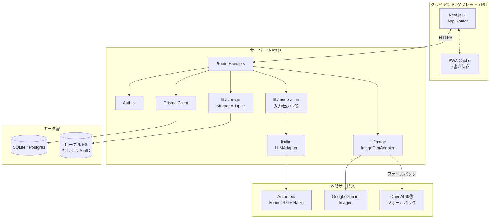

# 01. アーキテクチャと技術スタック

## 🧭 設計方針

1. **ローカル/オンプレ優先**: まず1台の PC でも全機能が動く。クラウド依存しない
2. **抽象化レイヤで切替可能**: LLM・画像・ストレージ・認証は Adapter パターンで差し替え
3. **安全性はアプリ層で保証**: LLM 任せにせず、モデレーション・出典付与・サンドボックスはコードで強制
4. **タブレットファースト**: iPad / Chromebook で快適に。PC・スマホも動く
5. **通信断でも最低限動く**: PWA で下書き保存、オフライン時は合図

---

## 🧱 技術スタック(確定版)

### フロントエンド
| 項目 | 選定 | 理由 |
|------|------|------|
| フレームワーク | **Next.js 14 (App Router)** | Route Handlers でフルスタック一体、Vercel 固有機能は使わない |
| 言語 | **TypeScript (strict)** | `any` 原則禁止、学童の安全に関わるコードは型で守る |
| UI ライブラリ | **Tailwind CSS + shadcn/ui** | 学童向けの大きめタップ領域・色調を組み立てやすい |
| アイコン | **Lucide** | オープン・豊富・やさしい線画 |
| ふりがな | **`<ruby>`** + 独自辞書(copy/\*.json) | ブラウザ標準、学年プロファイルで出し分け |
| 音声 | **Web Speech API** | ローカル完結、プライバシー良好。読み上げ・入力両対応 |
| PWA | **next-pwa** (もしくは workbox 直接) | 下書き保存・オフライン案内 |

### バックエンド
| 項目 | 選定 | 理由 |
|------|------|------|
| API | **Next.js Route Handlers** | フロントと一体、薄く保つ |
| バリデーション | **Zod** | 型からスキーマまで一貫 |
| DB | **SQLite + Prisma**(開発・オンプレ既定) | ファイル1つで動く。Postgres へは provider 切替 |
| Queue | Phase 1 では不要(同期)/ Phase 2 以降は **BullMQ + Redis** を検討 | 画像生成の非同期化 |

### LLM / AI
| 項目 | 選定 | 理由 |
|------|------|------|
| 対話・生成 | **Anthropic Claude Sonnet 4.6** (`claude-sonnet-4-6`) | 日本語品質・安全性・ツール使用の安定性 |
| モデレーション | **Anthropic Claude Haiku 4.5** (`claude-haiku-4-5-20251001`) | 高速・低コスト、入力フィルタに最適 |
| 画像生成 | **Google Gemini** (Imagen / Nano Banana) | ユーザー契約方針に基づく |
| 画像生成(代替) | **OpenAI gpt-image-1** | Gemini フォールバック |

### 認証
| 項目 | 選定 | 理由 |
|------|------|------|
| ライブラリ | **Auth.js (NextAuth v5)** | Credentials + Email の両対応 |
| 児童 | 学校コード + 児童 ID + **絵柄パスワード** | 本名不要、低学年でも覚えられる |
| 教員・保護者 | **マジックリンク** | パスワード管理不要、フィッシング耐性 |

詳細: [07-auth.md](07-auth.md)

### ストレージ
| 項目 | 選定 | 理由 |
|------|------|------|
| ローカル | ファイルシステム (`./storage`) | 即座に動く |
| 本番 | **MinIO** (S3 互換) | オンプレで自己ホスト可能 |
| クラウド切替 | AWS S3 / Cloudflare R2 | Adapter 差替のみ |

### 配布・運用
| 項目 | 選定 | 理由 |
|------|------|------|
| 開発起動 | `pnpm dev` 単体 | 最短3分セットアップ |
| ローカル本番風 | **docker compose** | Next.js + MinIO + MailHog + Postgres の1コマンド起動 |
| エラー監視 | **Sentry**(任意、`SENTRY_DSN` 未設定時は無効化) | 児童 PII を送らない設定必須 |
| 分析 | **PostHog**(任意、セルフホスト推奨) | クリックイベントのみ。会話内容は送信しない |

### テスト
| 項目 | 選定 |
|------|------|
| ユニット | **Vitest** |
| E2E | **Playwright**(タブレット viewport 含む) |
| プロンプト評価 | 独自の golden-test スイート(Claude API 応答の回帰) |

---

## 🏛️ アーキテクチャ図



---

## 📁 ディレクトリ構成

```
dreammake/
├── app/                           ← Next.js App Router
│   ├── (kids)/                    ← 児童用ルート(絵柄認証必須)
│   │   ├── home/                  ← ホーム(マイボット一覧)
│   │   ├── bots/
│   │   │   ├── new/               ← ボット作成
│   │   │   ├── [id]/              ← ボット詳細・対話
│   │   │   │   ├── knowledge/     ← ナレッジ登録
│   │   │   │   └── remix/         ← リミックス
│   │   │   └── plaza/             ← しらべもの広場
│   │   ├── units/[unitId]/        ← 単元ビュー(Phase 2〜)
│   │   │   ├── top/               ← 単元トップ(画面17)
│   │   │   ├── stance-map/        ← 立場マップ(画面18)
│   │   │   ├── ask-missing/       ← AIに出てこないのは誰?(画面19)
│   │   │   ├── standstill/        ← 立ち止まりセルフビュー(画面20)
│   │   │   └── surveys/           ← 事前/事後アンケート
│   │   ├── create/
│   │   │   ├── image/             ← 画像つくろう
│   │   │   ├── infographic/       ← インフォグラフィックつくろう
│   │   │   ├── video/             ← 動画つくろう(画面21、Phase 3)
│   │   │   ├── music/             ← BGM つくろう(Phase 3)
│   │   │   ├── quiz/              ← クイズ(画面22、Phase 3)
│   │   │   └── app/               ← つくってみようモード(Phase 5)
│   │   └── portfolio/             ← マイさくひん
│   ├── (teacher)/                 ← 教員用ルート
│   │   ├── dashboard/
│   │   ├── classes/
│   │   ├── incidents/
│   │   ├── units/                 ← 単元設計(画面13、Phase 2〜4)
│   │   │   ├── new/
│   │   │   └── [id]/
│   │   │       ├── design/
│   │   │       ├── surveys/       ← 事前事後結果(画面14)
│   │   │       ├── episodes/      ← エピソード記述レビュー(画面15)
│   │   │       └── cooccurrence/  ← 共起分析(画面16)
│   │   └── consents/              ← 同意記録の管理(保護者代行入力)
│   ├── (auth)/                    ← 認証ページ(児童+教員のみ)
│   └── api/                       ← Route Handlers
│       ├── bots/
│       ├── moderation/
│       ├── chat/                  ← SSE ストリーム
│       ├── image/
│       ├── video/                 ← 動画合成ジョブ(Phase 3)
│       ├── units/                 ← Unit CRUD(Phase 2)
│       ├── research/              ← 研究機能(standstill/cooccurrence/episode)
│       └── mini-app/
├── components/
│   ├── kids/                      ← 学童向け UI プリミティブ
│   ├── teacher/
│   ├── shared/
│   └── ui/                        ← shadcn/ui
├── lib/
│   ├── llm/
│   │   ├── adapter.ts             ← LLMAdapter interface
│   │   ├── anthropic.ts           ← Anthropic 実装
│   │   └── cache.ts               ← プロンプトキャッシュ制御
│   ├── image/
│   │   ├── adapter.ts
│   │   ├── gemini.ts
│   │   └── openai.ts
│   ├── storage/
│   │   ├── adapter.ts
│   │   ├── local.ts
│   │   └── minio.ts
│   ├── auth/
│   │   ├── kids-credentials.ts    ← 絵柄パスワード Provider
│   │   ├── magic-link.ts
│   │   └── session.ts
│   ├── moderation/
│   │   ├── input.ts               ← 入力段(Haiku)
│   │   ├── output.ts              ← 出力段
│   │   ├── pii.ts                 ← PII ルールベース前処理
│   │   └── incidents.ts           ← ハードブロック時の通知
│   ├── prompts/                   ← システムプロンプト生成器
│   │   ├── bot-runtime.ts
│   │   ├── moderation-input.ts
│   │   ├── moderation-output.ts
│   │   ├── mini-app-codegen.ts
│   │   ├── image-prompt-coach.ts
│   │   ├── image-prompt-safety.ts
│   │   └── infographic-gen.ts
│   ├── grade/                     ← 学年プロファイル
│   │   ├── profile.ts
│   │   ├── furigana.ts
│   │   └── copy.ts
│   ├── research/                  ← 探究単元・研究機能(Phase 2〜4)
│   │   ├── unit.ts                ← Unit / UnitHour の CRUD
│   │   ├── stance.ts              ← StanceSnapshot 集計
│   │   ├── standstill-rules.ts    ← 立ち止まり語のルールベース検出
│   │   ├── standstill-llm.ts      ← Haiku 併用の追加検出
│   │   ├── morphology.ts          ← kuromoji トークナイズ
│   │   ├── cooccurrence.ts        ← 共起ペア算出
│   │   ├── stats.ts               ← Wilcoxon 符号順位検定
│   │   ├── pii-mask.ts            ← 研究用 PII マスク(対話ログ匿名化)
│   │   ├── episode.ts             ← エピソード抽出ジョブ
│   │   └── anonymous-id.ts        ← 匿名 ID 生成
│   ├── video/                     ← 動画合成(Phase 3)
│   │   ├── compose.ts             ← Remotion for Browser によるスライド+TTS+BGM
│   │   └── slides.ts
│   ├── music/                     ← 簡易作曲(Phase 3)
│   │   ├── moods.ts               ← mood ラベル → パラメータ
│   │   └── compose.ts             ← Tone.js ベースの短いメロディ生成
│   ├── quiz/                      ← クイズ/ゲーム(Phase 3)
│   │   ├── types.ts
│   │   └── minority-find.ts
│   ├── sandbox/                   ← つくってみようモードの隔離(Phase 5)
│   │   ├── static-scan.ts         ← fetch/XHR/eval 検出
│   │   └── csp.ts
│   ├── rate-limit.ts
│   └── audit-log.ts
├── copy/                          ← UI コピー(学年別)
│   ├── lower.json
│   ├── middle.json
│   └── upper.json
├── prisma/
│   └── schema.prisma
├── public/
│   └── emoji/                     ← 絵柄パスワード用画像
├── docs/                          ← 設計ドキュメント(このフォルダ)
├── tests/
│   ├── unit/
│   ├── e2e/
│   └── prompts/                   ← golden-test
├── docker-compose.yml
└── package.json
```

---

## 🧩 抽象化レイヤ(ローカル → クラウド移行を可能に)

詳細は [08-api-abstractions.md](08-api-abstractions.md)。

- **LLMAdapter**: `complete`, `stream`, `moderate`, `generateCode` — Anthropic 既定
- **ImageGenAdapter**: `generate(prompt, options)` — Gemini 既定、OpenAI フォールバック
- **VideoAdapter**: `compose(slides, narration, bgm)` — Remotion for Browser(ローカル完結、サーバー送信なし)
- **MusicAdapter**: `compose(moodTags, durationSec)` — Tone.js(ブラウザ内)
- **CoOccurrenceAnalyzer**: `analyze(corpus)` — kuromoji + 独自集計、Claude で要約
- **StorageAdapter**: `put`, `get`, `delete`, `signedUrl` — Local FS / MinIO
- **AuthAdapter**: (NextAuth v5 の provider として実装。保護者 Provider は持たない)

---

## ⚡ パフォーマンス方針

- **プロンプトキャッシュ**: ボット本体のシステムプロンプト(ナレッジを含む最大部分)は Anthropic の `cache_control` で 5 分 TTL に乗せる。1ボット多会話で 60〜80% のトークンを削減見込み
- **ストリーミング応答**: 対話 UI は SSE で文字が出始めるまで 1 秒以内を目標
- **Lighthouse**: Performance 90+ / Accessibility 100 を目標

---

## 🔒 セキュリティ境界

- **API キーはサーバーのみ**: `ANTHROPIC_API_KEY` などが `NEXT_PUBLIC_*` に漏れていないか CI で検査
- **レート制限**: ユーザー単位・IP 単位・トークン単位の3軸。`lib/rate-limit.ts` で集中管理
- **監査ログ**: すべての LLM 呼び出しを `AuditLog` に記録(`userId`, `route`, `model`, `tokenIn`, `tokenOut`, `moderationResult`)
- **サンドボックス**: つくってみようモードの生成コードは iframe + CSP + 静的スキャン(詳細は [05-safety-and-privacy.md](05-safety-and-privacy.md))

---

## 🧪 環境の想定

| 環境 | DB | Storage | LLM | Image |
|------|----|---------|-----|-------|
| **開発** | SQLite ファイル | Local FS | Claude 実 API | Gemini 実 API(任意、モックあり) |
| **教室オンプレ** | SQLite もしくは Postgres | MinIO | Claude 実 API | Gemini 実 API |
| **クラウド(将来)** | Postgres (Supabase / 東京) | S3 / R2 | Claude 実 API | Gemini 実 API |

---

## 🔗 関連ドキュメント

- [02-data-model.md](02-data-model.md) — Prisma schema
- [05-safety-and-privacy.md](05-safety-and-privacy.md) — 安全設計
- [08-api-abstractions.md](08-api-abstractions.md) — Adapter インタフェース
- [10-phases.md](10-phases.md) — フェーズ別導入
