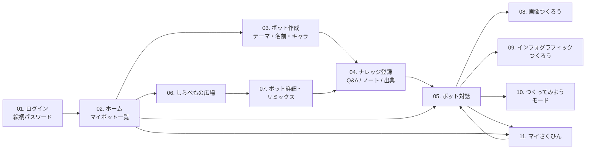
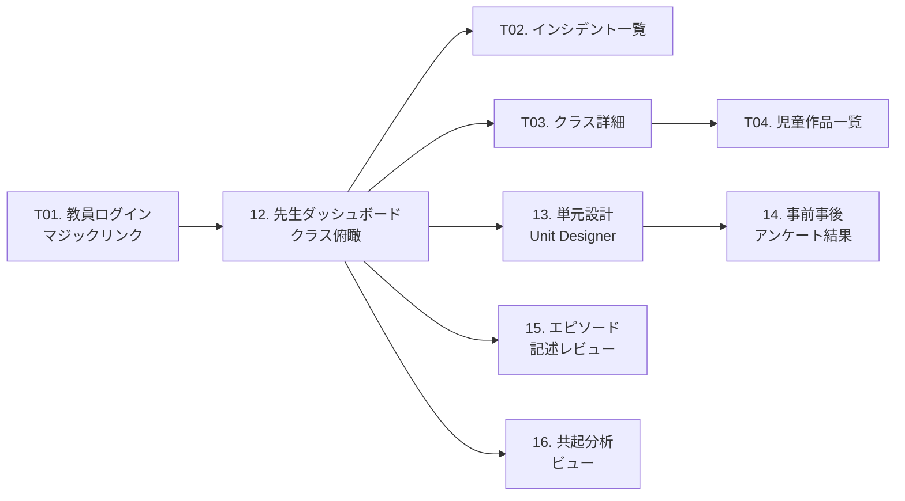
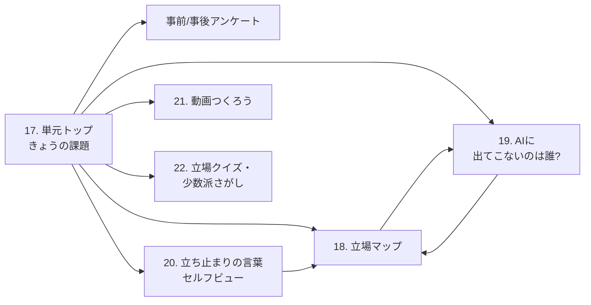

# 03. 画面遷移図と主要画面のワイヤー

## 🗺️ 画面遷移図(児童フロー)



## 🗺️ 画面遷移図(教員フロー)



## 🗺️ 単元(Unit)内の児童フロー



---

## 📱 画面別ワイヤー(主要 12 画面)

学年プロファイル(`lower` / `middle` / `upper`)ごとの差分は [06-grade-profiles.md](06-grade-profiles.md) 参照。以下は `middle` を基準に記述。

---

### 01. ログイン(絵柄パスワード)

**目的**: 児童が本名・メールなしで、教室のタブレットから安全にログインする。

```
┌────────────────────────────────────────┐
│ しらべてつくろう!AIラボ              │
├────────────────────────────────────────┤
│                                        │
│  🏫 学校コードをえらぼう              │
│  [ とうきょうしりつ◯◯しょう ▾ ]      │
│                                        │
│  🆔 じぶんの ID                       │
│  [ s-4-02-015              ]          │
│                                        │
│  🎨 あいことばの えをえらぼう         │
│                                        │
│  [ 🐟 ] [ 🌸 ] [ 🍎 ] [ 🚀 ]          │
│  [ 🐶 ] [ 🌞 ] [ 🎈 ] [ 🦋 ]          │
│  [ 🌈 ] [ 🌙 ] [ 🍩 ] [ ⭐ ]          │
│                                        │
│  えらんだ: [ 🐟 ] [ 🌸 ] [ 🍎 ]       │
│                                        │
│  [  はいる!  ]                        │
└────────────────────────────────────────┘
```

**重要な挙動:**
- 学校コードは端末に記憶(次回から省略可、教員設定で無効化可能)
- 連続失敗 5 回で 10 分ロック(`KIDS_AUTH_MAX_ATTEMPTS`)
- 低学年モードでは絵柄が大きく、2 個のみで OK の設定可能

---

### 02. ホーム(マイボット一覧)

**目的**: ログイン直後のランディング。自分のボット、お気に入り、広場への入り口。

```
┌──────────────────────────────────────────────┐
│ こんにちは、みさきさん 👋        [🔊] [⚙️]    │
├──────────────────────────────────────────────┤
│                                              │
│  ➕ あたらしいボットをつくる                 │
│                                              │
│  🤖 マイボット                               │
│  ┌──────────┐ ┌──────────┐ ┌──────────┐    │
│  │ メダカ君 │ │ 町せんせい│ │ 月はかせ │    │
│  │  🐟       │ │   🗼      │ │   🌙      │    │
│  │ 5カード  │ │ 12カード │ │ 3カード  │    │
│  └──────────┘ └──────────┘ └──────────┘    │
│                                              │
│  🎪 しらべもの広場 へ →                      │
│                                              │
│  🎨 マイさくひん(7こ) →                    │
│                                              │
│  ⏱️ きょうつかった時間: 15ふん               │
└──────────────────────────────────────────────┘
```

**重要な挙動:**
- 連続使用 20 分(`SAFETY_CONTINUOUS_USE_WARN_MINUTES`)で休憩モーダル
- ボットタップで対話画面へ、長押しで編集メニュー

---

### 03. ボット作成(テーマ・名前・キャラ)

**目的**: 3 ステップでボットの枠組みを作る。ナレッジ登録は次画面。

```
┌──────────────────────────────────────────────┐
│  あたらしいボットをつくろう    1 / 3         │
├──────────────────────────────────────────────┤
│                                              │
│  💡 なにをしらべたかな?(テーマ)            │
│  [ メダカのひみつ            ]                │
│                                              │
│  [ つぎへ →]                                 │
└──────────────────────────────────────────────┘

─── 2/3: 名前とキャラ ───
┌──────────────────────────────────────────────┐
│  🤖 ボットの なまえ                          │
│  [ メダカはかせ              ]                │
│                                              │
│  👀 みためは?                               │
│  ( 🐟 ) ( 🌸 ) ( 🧑‍🔬 ) ( 👽 ) ...           │
│                                              │
│  🗣️ はなしかた                               │
│  ( やさしい ) ( おもしろい ) ( ものしり )   │
│                                              │
│  [ つぎへ →]                                 │
└──────────────────────────────────────────────┘

─── 3/3: メタ認知カード ───
┌──────────────────────────────────────────────┐
│  このボットは…(じぶんで かんがえてみよう)│
│                                              │
│  ✨ とくいなこと                             │
│  [ めだかの しゅるいと たまごの そだて方 ]   │
│                                              │
│  🤔 にがてなこと                             │
│  [ めだかの びょうきの ことは まだしらない ]│
│                                              │
│  [ つくる ✨]                                │
└──────────────────────────────────────────────┘
```

---

### 04. ナレッジ登録(Q&A / ノート / 出典)

**目的**: 調べた知識をボットに教える。**出典を必須化**するのが教育的核心。

```
┌──────────────────────────────────────────────┐
│ メダカはかせに おしえよう        [保存中]    │
├──────────────────────────────────────────────┤
│  ( Q&A ) ( ノート ) ( 写真からよむ ) (PDF)   │
├──────────────────────────────────────────────┤
│                                              │
│  Q: メダカは なにを たべるの?               │
│  [_________________________________]         │
│                                              │
│  A: ミジンコや ボウフラをたべるよ。          │
│     えさは 1日 2回 あげるのが いいよ。       │
│  [_________________________________]         │
│                                              │
│  📚 どこから しらべた?(出典)               │
│  ( 本 ) ( ネット ) ( しゃざい ) ( かんさつ ) │
│  [ 図かん「メダカのかいかた」3ページ  ]       │
│                                              │
│  [ ➕ もういっこ Q&A をたす ]                │
│  [ 🎤 こえでいれる ]                         │
│                                              │
│  [ 保存してボットをためす → ]                │
└──────────────────────────────────────────────┘
```

**重要な挙動:**
- 出典が空だと保存不可。赤枠で注意(「だいじなことだから、どこから しったか かいてね」)
- 画像 / PDF は OCR(Claude Vision)でテキスト抽出 → 子どもが編集
- 音声入力は Web Speech API、書き起こし後に編集可能
- 入力ごとに裏で入力モデレーション(Haiku)が走る

---

### 05. ボット対話

**目的**: 作ったボットと対話して、覚えたことを確認する。

```
┌──────────────────────────────────────────────┐
│ ← メダカはかせ 🐟                            │
├──────────────────────────────────────────────┤
│                                              │
│  [🐟] メダカのこと、なんでもきいてね!       │
│                                              │
│  [👧] えさはなにをあげるの?                 │
│                                              │
│  [🐟] ミジンコや ボウフラをたべるよ。        │
│       えさは 1日 2回 あげるのが いいよ。    │
│       📚 出典:図かん「メダカのかいかた」    │
│                                              │
│  [👧] うちゅう旅行はできるの?               │
│                                              │
│  [🐟] それはまだ調べていないよ、            │
│       いっしょに調べてみよう!               │
│       [ ➕ このことを しらべる ]             │
│                                              │
│  ⚠️ AI は まちがえることがあるよ             │
│                                              │
│  [ 🎤 ] [ _____________________ ] [ ▶ ]    │
│                                              │
│  [ 🎨 絵をつくる ] [ 📊 まとめる ]           │
└──────────────────────────────────────────────┘
```

**重要な挙動:**
- 応答は SSE ストリーミング、出典行は完成後に機械付与
- 「まだ調べていない」応答では「このことを しらべる」ボタンが出現 → 04 画面へ
- 「AI は まちがえることがあるよ」は常設(非常駐ヘッダ)
- 対話中の入力は常に入力モデレーションを通る

---

### 06. しらべもの広場

**目的**: クラス内で公開されたボットと対話・リアクションする。

```
┌──────────────────────────────────────────────┐
│ ← しらべもの広場 🎪                          │
├──────────────────────────────────────────────┤
│  [ おすすめ ] [ あたらしい ] [ いいね順 ]    │
│                                              │
│  ┌────────────────────────────────────┐     │
│  │ 🗼 わたしたちの町 by たけしさん    │     │
│  │ 商店街のひみつ・公園の歴史など     │     │
│  │ 💗 12  💬 34  🧪 このボットとはなす │     │
│  │ [ 🔀 リミックスして自分のボットに ] │     │
│  └────────────────────────────────────┘     │
│                                              │
│  ┌────────────────────────────────────┐     │
│  │ 🌙 月のクレーター by ゆいさん       │     │
│  │ ...                                 │     │
│  └────────────────────────────────────┘     │
└──────────────────────────────────────────────┘
```

**重要な挙動:**
- 検索・コメントの自由記述は**モデレーション**を通す。NG 時は優しい案内
- リアクションは定型スタンプのみ
- リミックスは出典を必ず継承

---

### 07. ボット詳細・リミックス

```
┌──────────────────────────────────────────────┐
│ ← 🗼 わたしたちの町                          │
├──────────────────────────────────────────────┤
│  つくった人: たけしさん(4-1)                 │
│  しらべたテーマ: 商店街のひみつ              │
│                                              │
│  📚 出典(12件)                              │
│  ・「わたしたちの ◯◯町」東京書籍            │
│  ・商店街の田中さんへの しゃざい             │
│  ・...                                       │
│                                              │
│  🃏 Q&Aカード(14枚)                         │
│  ・Q: 商店街はいつできた? → A: 1956年...   │
│                                              │
│  [ 💗 いいね ] [ 💬 しつもんスタンプ ]       │
│                                              │
│  ─── リミックス ───                          │
│  [ 🔀 このボットをコピーして自分で育てる ]   │
│  ※ 出典はそのまま うけつぐよ                 │
└──────────────────────────────────────────────┘
```

---

### 08. 画像つくろう(Phase 2)

**目的**: AI と対話しながら画像生成のプロンプトを組み立て、生成する。

```
┌──────────────────────────────────────────────┐
│ ← 🎨 絵をつくろう                            │
├──────────────────────────────────────────────┤
│  🐟 メダカはかせ:                            │
│  どんな場面の絵をかく?                      │
│                                              │
│  [👧] メダカが たまごをうむところ            │
│                                              │
│  🐟 メダカはかせ:                            │
│  いいね!いつの時間? どんな気持ち?         │
│                                              │
│  [👧] あさ。ドキドキしてる。                 │
│                                              │
│  ─── できるプロンプト(おとなモード) ───    │
│  "A detailed scientific illustration of a   │
│   medaka fish laying eggs in the morning    │
│   light, gentle aquatic plants, warm..."    │
│                                              │
│  [ ✨ 絵をつくる ]                           │
└──────────────────────────────────────────────┘
```

**重要な挙動:**
- Claude が質問で場面・気持ちを引き出す([image-prompt-coach.md](04-prompts/image-prompt-coach.md))
- 最終プロンプトは**安全化フィルタ**を通してから画像 API へ([image-prompt-safety.md](04-prompts/image-prompt-safety.md))
- 生成画像は `Artwork` に保存、出典は元の Bot から継承

---

### 09. インフォグラフィックつくろう(Phase 2)

**目的**: 調べたことを図解にまとめる。テンプレから選んで AI が初版を作る。

```
┌──────────────────────────────────────────────┐
│ ← 📊 まとめよう                              │
├──────────────────────────────────────────────┤
│  どんなまとめ?                              │
│                                              │
│  ┌───────┐ ┌───────┐ ┌───────┐ ┌───────┐   │
│  │くらべる│ │じゅんばん│ │まとめ │ │ちず   │   │
│  │ 📊    │ │ ➡️➡️   │ │ 📖    │ │ 🗺️    │   │
│  └───────┘ └───────┘ └───────┘ └───────┘   │
│                                              │
│  [ 選ぶ → ]                                  │
└──────────────────────────────────────────────┘

─── 生成結果(編集画面) ───
┌──────────────────────────────────────────────┐
│ [プレビュー]                  [編集パネル]   │
│  ┌──────────────────┐         [色] [文字]    │
│  │ メダカのたまご   │          [アイコン]    │
│  │  ・大きさ 1mm    │          [テンプレ変更]│
│  │  ・日数 10〜14日 │                        │
│  │  ・水温 25℃     │                        │
│  └──────────────────┘                        │
│                                              │
│  [ 💾 保存して共有 ]                         │
└──────────────────────────────────────────────┘
```

**重要な挙動:**
- Claude が HTML+SVG を生成([infographic-gen.md](04-prompts/infographic-gen.md))
- 編集は色・文字・アイコン差替の簡易エディタ(`react-colorful` 等)

---

### 10. つくってみようモード(Phase 3)

**目的**: 自然言語で簡単な Web アプリを作る。疑似 Claude Code。

```
┌────────────────────────────────────────────────────┐
│ ← 🧰 つくってみよう                                │
├────────────────────────────────────────────────────┤
│  [AI と はなす]     [ブロックエディタ]  [プレビュー]│
│  ┌────────────┐   ┌────────────┐    ┌──────────┐ │
│  │ つくりたい: │   │ 📦 ボタン   │    │ (iframe) │ │
│  │ クイズアプリ│   │ 📝 ラベル   │    │          │ │
│  │            │   │ 🎯 クイズ   │    │ ❓ 問題  │ │
│  │ Claude:    │   │ ...         │    │ [回答]   │ │
│  │ 何問つくる?│   │             │    │          │ │
│  │            │   │             │    │          │ │
│  │ [3問!]    │   │             │    │          │ │
│  └────────────┘   └────────────┘    └──────────┘ │
│                                                    │
│  [ 🔁 つくりなおす ] [ 💾 マイさくひんに保存 ]     │
└────────────────────────────────────────────────────┘
```

**重要な挙動:**
- Claude が単一 HTML(CSS+JS 内包)を生成([mini-app-codegen.md](04-prompts/mini-app-codegen.md))
- iframe `sandbox="allow-scripts"` + CSP `default-src 'none'` + 静的スキャンで `fetch`/`XHR`/`eval`/`import` 検出
- 会話修正で部分的に書き換え可能

---

### 11. マイさくひん(ポートフォリオ)

```
┌──────────────────────────────────────────────┐
│ 🎨 マイさくひん                              │
├──────────────────────────────────────────────┤
│  [ 絵 ] [ まとめ ] [ アプリ ] [ ボット ]     │
│                                              │
│  2026-04-15 絵: メダカの産卵                 │
│  2026-04-12 まとめ: メダカのそだてかた       │
│  2026-04-10 ボット: メダカはかせ             │
│  ...                                         │
│                                              │
│  [ 📄 ワークシート PDF をダウンロード ]      │
│  (Phase 4)                                   │
└──────────────────────────────────────────────┘
```

---

### 12. 先生ダッシュボード(Phase 1 簡易版 → Phase 4 で本格化)

```
┌────────────────────────────────────────────────┐
│ 👩‍🏫 4年2組 ダッシュボード         [マイクラス▾]│
├────────────────────────────────────────────────┤
│  📊 きょうの様子                                │
│   アクティブ児童: 28/32                         │
│   新規ボット: 3  / 作品: 12                     │
│                                                │
│  🚨 気になる通知(24h)                         │
│   ・🔴 alert: ハードブロック 2件                │
│   ・🟡 warn : 連続使用超過 5件                  │
│   [ 詳細を見る → ]                              │
│                                                │
│  👧👦 児童一覧(進捗・最終活動)                │
│   みさき      🤖3 🎨7  最終: 3分前              │
│   たけし      🤖2 🎨2  最終: 15分前             │
│   ...                                           │
│                                                │
│  🎪 広場の人気ボット                            │
│   「わたしたちの町」💗12  「月」💗8  「メダカ」💗5│
└────────────────────────────────────────────────┘
```

**重要な挙動:**
- インシデント詳細は児童の生発話ではなく**PII マスク済み要約**を表示
- 生発話を見る操作は再認証(マジックリンク再送)を要求

---

### 13. 単元設計(Unit Designer・教員)

**目的**: 中単元(10〜15時間)の骨子を、AI 挿入ポイント 3 点と教科横断タグとともに設計。

```
┌──────────────────────────────────────────────────────────────┐
│ 📘 単元をつくる                          [ 保存 ] [ 公開 ]   │
├──────────────────────────────────────────────────────────────┤
│ タイトル:  [ わたしたちの町の昔と今                      ]   │
│ 中心の問い:[ この町の未来を決めるとき、だれの声が聞かれ…]    │
│ 学年: 4年  時数: 12時間  主教科: 社会                        │
│ 教科横断: [✓国語 ✓図工 ✓音楽 □総合 □プログラミング]         │
│                                                              │
│ [ ✨ AI に骨子を提案してもらう ]                             │
├──────────────────────────────────────────────────────────────┤
│  h1  ☑ pre survey  導入・問いの共有          [none]          │
│  h2  地域資料を読む                          [before-self]   │
│  h3  インタビュー計画                        [none]          │
│  h4  取材と事実整理                          [none]          │
│  h5  立場マップ初版                          [none]          │
│  h6  自分の考えをまとめる → AIと突き合わせ   [after-self] ⭐│
│  h7  論点の対立整理                          [none]          │
│  h8  AI対話で広げる                          [after-self]   │
│  h9  AIに出てこないのは誰?(中盤)            [ask-missing]⭐│
│  h10 少数立場を調べ直す                      [none]          │
│  h11 表現:動画/音楽/作文                    [none] 🎨       │
│  h12 ☑ post survey  もう一度問う・振り返り   [ask-missing]⭐│
│                                                              │
│ 想定される立場(3〜6):                                       │
│  ✏️ 商店街のお店の人 / 子育て家庭 / 観光客 /                 │
│     引っ越してきたばかりの人 / 動物や川 / まだ生まれていない…│
│                                                              │
│ ⚠️ 配慮点: 地域の商店街とのセンシティブな論点…              │
└──────────────────────────────────────────────────────────────┘
```

**重要な挙動:**
- 「AI に骨子を提案」は [unit-scaffold.md](04-prompts/unit-scaffold.md) を呼び、`UnitHour[]` を draft として入れる
- 各 hour の `aiInsertion` を `none / before-self / after-self / ask-missing` から切替
- pre / post アンケートは同ページで [pre-post-survey-gen.md](04-prompts/pre-post-survey-gen.md) から生成、編集必須
- 公開前に「編集してから承認」チェック必須
- `Unit.researchMode` を ON にすると、エピソード抽出と共起分析の自動実行が有効

---

### 14. 事前事後アンケート結果(教員)

**目的**: pre/post の 3 軸比較を可視化。個別児童の変化も一覧で。

```
┌──────────────────────────────────────────────────────────────┐
│ 📊 事前事後アンケート結果: わたしたちの町の昔と今            │
├──────────────────────────────────────────────────────────────┤
│  N=32  提出率: pre 31/32 · post 30/32                        │
│                                                              │
│ 軸1. 最初に挙がる立場の内訳                                  │
│  pre:  ██████ お店 12 | ████ 子育て 8 | ██ 動物 3 | … 9      │
│  post: ████ お店 8    | ██████ 子育て 11 | ████ 動物 7 | …  │
│  → 選択の分布が広がった / 動物・非人間が pre 3 → post 7      │
│                                                              │
│ 軸2. 目立つ立場への集中度(likert 平均)                      │
│  pre:  3.8  → post: 3.1  (Wilcoxon p=0.02, 減)              │
│                                                              │
│ 軸3. 違う考えへの意識(likert 平均)                          │
│  pre:  2.9  → post: 3.7  (Wilcoxon p<0.01, 増)              │
│                                                              │
│ 立ち止まりの言葉 1児童平均                                   │
│  pre ふり: 1.1 / post ふり: 3.4  (Wilcoxon p<0.01, 増)      │
│                                                              │
│ ⚠️ 読み方の注意(AI 要約):                                  │
│  - N=32 の単校検証につき一般化には慎重さを要する              │
│  - 「でも」の増加はためらいの増加とは限らない                 │
│                                                              │
│ [ 📄 PDF に書き出す ] [ エピソード記述を見る → ]            │
└──────────────────────────────────────────────────────────────┘
```

**重要な挙動:**
- 統計は `lib/research/stats.ts`(Wilcoxon 符号順位検定の実装、ノンパラ)
- Chart は Recharts(shadcn 互換)、色は色覚多様性パレット
- PDF 出力は Phase 4(教員の研究成果共有用)

---

### 15. エピソード記述レビュー(教員)

**目的**: AI が抽出したエピソードを教員が編集・承認。研究記述の下書き補助。

```
┌──────────────────────────────────────────────────────────────┐
│ 📝 エピソード記述: 児童 anon-AC4F (4年2組)  [ 全候補に戻る ]│
├──────────────────────────────────────────────────────────────┤
│ タイトル: 多数派へ寄った後、別の立場への気づきが出た場面     │
│ タグ: [majority-pull] [standstill] [reframing]               │
│ salience: high                                               │
│                                                              │
│ narrative (AI ドラフト、編集してください):                  │
│ ┌──────────────────────────────────────────────────────┐   │
│ │単元の中盤、児童は最初『△△の立場』を強く支持していた│   │
│ │が、対話の中で AI が『□□の視点ばかり返している』と振│   │
│ │り返り、『でも、おばあちゃんに聞いたら違うことを…』と│   │
│ │書いた。続けて『もしかしたら、AI に出てこない声が…』と│   │
│ │仮説を書いている。…                                  │   │
│ └──────────────────────────────────────────────────────┘   │
│                                                              │
│ 教員ノート(自由記述):                                     │
│ [                                                        ]   │
│                                                              │
│ 出典:                                                       │
│ - chat msg-f2a (3時間目)                                    │
│ - reflection ref-8c9 (3時間目の振り返り)                   │
│ - missing-voice mv-44e (4時間目)                            │
│                                                              │
│ [ 却下 ] [ 編集して承認 ]                                    │
└──────────────────────────────────────────────────────────────┘
```

**重要な挙動:**
- AI ドラフトを**編集しないと承認できない**(そのまま承認ボタンなし)
- `narrative` は児童 PII を含まない匿名化済み、教員が加筆する場合もその制約は維持
- 「出典」の対話/振り返りは**教員再認証後**に原文(PII 復号)を閲覧可
- 承認されたエピソードは `EpisodeRecord(status='approved')` に、PDF にもまとまる

---

### 16. 共起分析ビュー(教員)

**目的**: 児童の記述語彙の変化を俯瞰。立ち止まりの言葉の共起パートナーに注目。

```
┌──────────────────────────────────────────────────────────────┐
│ 🔬 共起ネットワーク:わたしたちの町の昔と今  [pre|mid|post]  │
├──────────────────────────────────────────────────────────────┤
│ 上位語 (post, 振り返り):                                     │
│  お店 42 · ベビーカー 28 · でも 26 · 気持ち 21 · 声 19 ...   │
│                                                              │
│ 立ち止まり語の共起パートナー 変化                            │
│  「でも」:                                                   │
│    pre:  ムリ / できない / 混む                             │
│    post: わかる / 気持ち / 立場 / もしかしたら              │
│                                                              │
│ 注目クラスター(AI 要約):                                  │
│  ・「他者への気づき」: 気持ち・立場・ちがい・聞こえない     │
│  ・「ためらいの言葉」: でも・もしかしたら・ほんとに         │
│  ・「お店の困りごと」: お店・混雑・駐車場・子育て           │
│                                                              │
│ ⚠️ 読み方の注意:                                            │
│  N=32 の分布、個人の大発話が左右の可能性                     │
│                                                              │
│ [ エピソード記述と照らす → ]                                │
└──────────────────────────────────────────────────────────────┘
```

**重要な挙動:**
- 共起計算は `lib/research/cooccurrence.ts`(kuromoji + 独自集計)
- 可視化はシンプルな棒+クラスター(ネットワークは Phase 4 で visx / d3)
- 要約は [co-occurrence-summary.md](04-prompts/co-occurrence-summary.md) の Sonnet 出力

---

### 17. 単元トップ(児童)

**目的**: 児童の入り口。きょうの課題、AI 挿入ポイントが明確に。

```
┌──────────────────────────────────────────────────────────────┐
│ 📘 わたしたちの町の昔と今     (きょうは 5じかん目 / 12)      │
├──────────────────────────────────────────────────────────────┤
│  きょうの ちゅうしんの問い:                                  │
│  「この町の未来をきめるとき、だれの声が聞かれていない?」    │
│                                                              │
│  きょうの 活動:                                              │
│    立場マップを ひろげよう                                   │
│                                                              │
│  [ 🗺️ 立場マップへ ]                                        │
│  [ 🔍 AIに出てこないのは だれ? ]  ⭐ きょうの ポイント       │
│  [ ✍️ ふりかえりを書く ]                                     │
│  [ 🎨 動画やクイズをつくる ]                                 │
│                                                              │
│  📊 じぶんの 立ち止まりメーター: ★★☆☆☆                      │
│  これまでに 3回 立ち止まって 考えられたよ!                  │
└──────────────────────────────────────────────────────────────┘
```

**重要な挙動:**
- 該当 hour の `aiInsertion` に応じた CTA を強調表示
- pre/post アンケート配布時は最上部にピン留め
- 立ち止まりメーターは `ReflectionEntry.standstillCount` 累積、児童のセルフ確認用(成績ではない)

---

### 18. 立場マップ(児童)

**目的**: 単元で出てきた立場のビジュアルマップ。自分の立場(スタンプ)を置ける。少数派も「おおきく」残す。

```
┌──────────────────────────────────────────────────────────────┐
│ 🗺️ 立場マップ:わたしたちの町                  [ 自分を置く ]│
├──────────────────────────────────────────────────────────────┤
│                                                              │
│    🏪 お店の人                  🚼 子育て家族                │
│    ・・みさき★ けんた           ・・ゆい                    │
│                                                              │
│    🗼 観光客          🐦 川の生きもの                        │
│    ・・・            ★ あきら(1人だけ)                     │
│                                                              │
│    👵 引っ越したばかりの人                                   │
│    ★ じぶん(わたし)                                        │
│                                                              │
│    🌿 まだ生まれていない人                                   │
│    (まだ 誰も いないね)                                    │
│                                                              │
│ [ ➕ 新しい立場を つけたす ] [ 🔍 出てこないのは誰? ]      │
└──────────────────────────────────────────────────────────────┘
```

**重要な挙動:**
- 立場のスタンプは `StanceSnapshot` に記録(時系列)
- **少数派の立場も大きく表示**(1 人でも見やすい位置に)
- 新しい立場の追加は `Stance.proposedBy='child'` で保存、教員の承認待ち
- 各児童はニックネームのみ、教員モードでは実名

---

### 19. AIに出てこないのは誰?(児童)

**目的**: 単元の研究の**核**。AI の応答を児童が批判的に見る場。

```
┌──────────────────────────────────────────────────────────────┐
│ 🔍 AIに出てこないのは だれ?                                  │
├──────────────────────────────────────────────────────────────┤
│  きょうのボット:町せんせい 🗼                                │
│  さっきの会話:                                               │
│  ─────────────────────────                                 │
│  👧 お店の人は こまらないかな?                              │
│  🗼 商店街は ひろばをつくると…(略)                          │
│  👧 子育ての家族は?                                         │
│  🗼 ベビーカーが とおれる道が…(略)                         │
│  ─────────────────────────                                 │
│                                                              │
│  AI が つよく出していた立場:                                 │
│   ・大人のお店の人                                           │
│   ・車で きている人                                          │
│                                                              │
│  出てこなかったかもしれない声(仮説):                      │
│   🍼 赤ちゃん・乳児(話せないから?)                        │
│   🐱 その町の動物・川(AI は人の声を返しやすい)            │
│   👵 昔その町に住んでいた人(今はもういない)                │
│   ✏️ ほかに 気になる声を かこう: [ ______________ ]         │
│                                                              │
│  あなたの しつもん:                                          │
│  「この中で あなたが 大切だと思う声は? なぜ?」             │
│  [_________________________________________________]         │
│                                                              │
│  [ 📤 クラスにシェアする ] [ もう一度 AIに きいてみる ]     │
└──────────────────────────────────────────────────────────────┘
```

**重要な挙動:**
- [missing-voice-probe.md](04-prompts/missing-voice-probe.md) の出力を表示
- 児童が選んだ候補 + 自由記述 = `MissingVoiceHypothesis` として保存
- 「クラスにシェア」で画面 18 に反映、他児童がそれを読んで探究を広げられる
- 単元の `ask-missing` 回ではこの画面が CTA として前面に

---

### 20. 立ち止まりの言葉セルフビュー(児童)

**目的**: 自分の振り返りと対話から「でも/なぜ/別の見方をすれば」を可視化。成績ではなく自分のための鏡。

```
┌──────────────────────────────────────────────────────────────┐
│ 📝 じぶんの たちどまりメーター                                │
├──────────────────────────────────────────────────────────────┤
│ 今週の たちどまり 4回                                         │
│                                                              │
│   「でも」 2回                                               │
│   「もしかしたら」 1回                                       │
│   「〇〇さんの気もちに なると」 1回                          │
│                                                              │
│ 📖 3じかん目のふりかえり より:                              │
│  「お店の人は こまっているかも。                            │
│   [でも] ベビーカーの人も こまる…」                         │
│         ^^^^^                                                │
│                                                              │
│  「もし わたしが 引っ越してきたばかり だったら…」           │
│   ^^^^^^^^^^^^^^^^^^^^^^^^^                                  │
│                                                              │
│ "4回、立ち止まって考えられたね"                              │
│                                                              │
│ [ ✍️ きょうの振り返りを 書く ]                              │
└──────────────────────────────────────────────────────────────┘
```

**重要な挙動:**
- 児童のみ、自分の `ReflectionEntry` 一覧から集計
- 同じ内容を教員は画面 12(ダッシュボード)でクラス平均として見る
- [standstill-detection.md](04-prompts/standstill-detection.md) の出力を使う

---

### 21. 動画つくろう(児童)

**目的**: 立場の「語り」を、スライド+TTS+BGM の簡易動画に。国語の論述・図工の構成・音楽の表現と接続。

```
┌──────────────────────────────────────────────────────────────┐
│ 🎬 動画をつくろう:「わたしの知らない 誰かの声」              │
├──────────────────────────────────────────────────────────────┤
│ 選んだ立場: 🐱 川の動物                                      │
│                                                              │
│ スライド(3枚):                                             │
│  [1] タイトル:「川の動物 のこえ」                            │
│      🖼️ 川のイラスト(つくった絵から選択)                  │
│  [2] きもち:「むかしは 水が きれいだった…」                 │
│  [3] おねがい:「ゴミを ひろってくれる?」                    │
│                                                              │
│ 🗣️ ナレーション(じぶんで書いた文章を読み上げ):            │
│   [Web Speech Synthesis でプレビュー ▶]                     │
│                                                              │
│ 🎵 BGM:                                                     │
│  ( やさしい ) ( しずか ) ( ゆっくり ) ( ちょっと さびしい ) │
│  ※ 音楽は つくろうモードと つながっているよ                 │
│                                                              │
│ [ 📹 動画を作る ] [ 💾 下書き保存 ]                         │
└──────────────────────────────────────────────────────────────┘
```

**重要な挙動:**
- 動画は Remotion for Browser で合成(サーバー送信なし、音声も Web Speech + WebAudio で Mix)
- 生成された MP4 は Storage に保存(`Artwork.kind='video'`)
- 立場 ID を記録(`Artwork.videoStanceId`)
- BGM は画面で選んだ mood から、`lib/music/` が短いメロディを生成(Tone.js)
- 文章は児童が書く。Claude は「論述ガイド」だけ提供(コーチ役)

---

### 22. 立場クイズ・少数派さがし(児童)

**目的**: ゲーム感覚で立場を考える。クラスで遊べる。

```
┌──────────────────────────────────────────────────────────────┐
│ 🎯 立場クイズ:「これは だれの声?」                          │
├──────────────────────────────────────────────────────────────┤
│  問題 3 / 5                                                  │
│                                                              │
│  「むかしは この川で よく あそべたのに、                    │
│   いまは あぶないって 入れないの」                          │
│                                                              │
│  だれの こえかな?                                           │
│   A. 商店街の人                                             │
│   B. 昔からこの町に住んでいる おとしより                    │
│   C. 観光客                                                 │
│   D. 赤ちゃん                                               │
│                                                              │
│  [ B ] を えらぶ                                            │
└──────────────────────────────────────────────────────────────┘

─── 少数派さがしモード ───
┌──────────────────────────────────────────────────────────────┐
│ 🔎 少数派さがし                                              │
│                                                              │
│ クラスの 32人が えらんだ 立場の なかで、                     │
│ いちばん 少ないのは どれだった?                             │
│                                                              │
│  [ ベビーカー 8人 ] [ 川の動物 3人 ] [ お店 12人 ] …        │
│                                                              │
│ ── 川の動物 を 3人が 選んでいました ──                      │
│ その3人の理由を 読んでみよう(名前はかくしてあるよ)        │
│  ・「生きものも この町の なかまだから」                     │
│  ・「水が よごれたら みんな こまる」                        │
│  ・…                                                        │
└──────────────────────────────────────────────────────────────┘
```

**重要な挙動:**
- クイズは `Artwork.kind='quiz'`, `quizKind='stance-match'` / `'minority-find'`
- 正解は単一でなく、**「根拠が合えばすべて正解」**モードあり(価値判断を含まない)
- 少数派さがしは匿名化した `StanceSnapshot` 集計を児童に可視化
- クラスでプロジェクターに映して遊ぶモードも(教員操作)

---

## 🎯 画面横断の設計原則

- **下部プライマリアクション**: タブレット持ち手の親指に近い位置に主要ボタン(最小 44×44px)
- **音声ボタンは常設**: すべてのテキスト入力欄に 🎤 を併設
- **読み上げ**: 本文にカーソルを置くと 🔊 アイコン、タップで Web Speech Synthesis 起動
- **学年切替**: ⚙️ → プロファイル切替(児童は教員からの許可が必要)
- **オフライン**: 通信断時は画面上部に優しいバナー。下書きは IndexedDB に自動保存

---

## 🔗 関連ドキュメント

- [06-grade-profiles.md](06-grade-profiles.md) — 学年ごとの UI 差分
- [04-prompts/](04-prompts/) — 各画面で使う Claude API プロンプト
- [07-auth.md](07-auth.md) — ログイン画面の詳細
