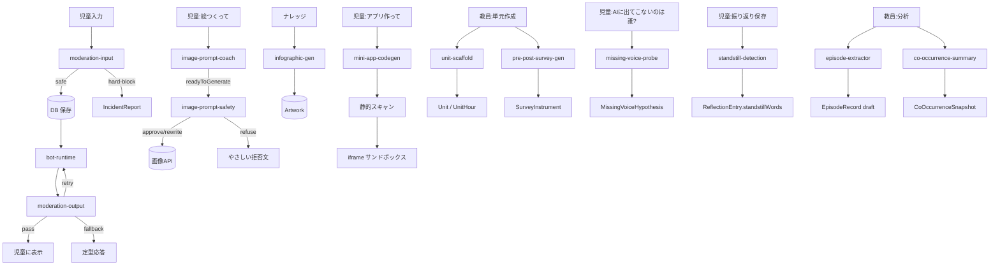

# 04. Claude API プロンプト設計書 目次

このフォルダには、アプリが Claude API(および画像生成 API の前段)に渡すすべての
システムプロンプトの設計書が含まれます。

各ドキュメントは次の 5 セクションで統一されています:

1. **目的** — なにを達成するプロンプトか
2. **モデル・呼び出し設定** — モデル名、温度、max_tokens、キャッシュの有無
3. **入出力スキーマ** — TypeScript 型で定義
4. **システムプロンプト(完成文)** — そのまま `lib/prompts/*.ts` で組み立てられる完成テンプレ
5. **評価観点 / 既知の失敗パターン** — golden-test の観点

---

## プロンプト一覧

### 対話・表現
| # | ドキュメント | 使用モデル | 使用場所 |
|---|----------|-----------|---------|
| 1 | [bot-runtime.md](bot-runtime.md) | Sonnet 4.6 | ボット対話(05画面) |
| 2 | [moderation-input.md](moderation-input.md) | Haiku 4.5 | あらゆる児童入力の保存前 |
| 3 | [moderation-output.md](moderation-output.md) | Haiku 4.5 | ボット応答の表示前 |
| 4 | [mini-app-codegen.md](mini-app-codegen.md) | Sonnet 4.6 | つくってみようモード(10画面) |
| 5 | [image-prompt-coach.md](image-prompt-coach.md) | Sonnet 4.6 | 画像つくろう 対話段(08画面) |
| 6 | [image-prompt-safety.md](image-prompt-safety.md) | Haiku 4.5 | 画像生成 API 呼び出し直前 |
| 7 | [infographic-gen.md](infographic-gen.md) | Sonnet 4.6 | インフォグラフィックつくろう(09画面) |

### 単元・研究(他者性を育てるためのプロンプト群)
| # | ドキュメント | 使用モデル | 使用場所 |
|---|----------|-----------|---------|
| 8 | [missing-voice-probe.md](missing-voice-probe.md) | Sonnet 4.6 | 「AIに出てこないのは誰?」(19画面) |
| 9 | [standstill-detection.md](standstill-detection.md) | Haiku 4.5 | 振り返り保存時・対話終了時(バッチ) |
| 10 | [episode-extractor.md](episode-extractor.md) | Sonnet 4.6 | 教員ダッシュボード(15画面) |
| 11 | [co-occurrence-summary.md](co-occurrence-summary.md) | Sonnet 4.6 | 教員ダッシュボード(16画面) |
| 12 | [pre-post-survey-gen.md](pre-post-survey-gen.md) | Sonnet 4.6 | 単元設計(13画面)事前事後 |
| 13 | [unit-scaffold.md](unit-scaffold.md) | Sonnet 4.6 | 単元設計(13画面)骨子提案 |

---

## プロンプト間の呼び出し関係

---

## 実装側のルール

- プロンプト本文は `lib/prompts/{name}.ts` の `build{Name}Prompt(input)` 関数で組み立てる
- 関数は純粋関数(副作用なし)。テンプレート展開のみ
- API 呼び出しは `lib/llm/anthropic.ts` の統一インタフェース経由
- プロンプトのバージョニング: `lib/prompts/versions.ts` で集中管理、`AuditLog.meta` に記録

---

## 🔗 関連ドキュメント

- [../05-safety-and-privacy.md](../05-safety-and-privacy.md) — モデレーションの全体像
- [../08-api-abstractions.md](../08-api-abstractions.md) — `LLMAdapter` インタフェース
