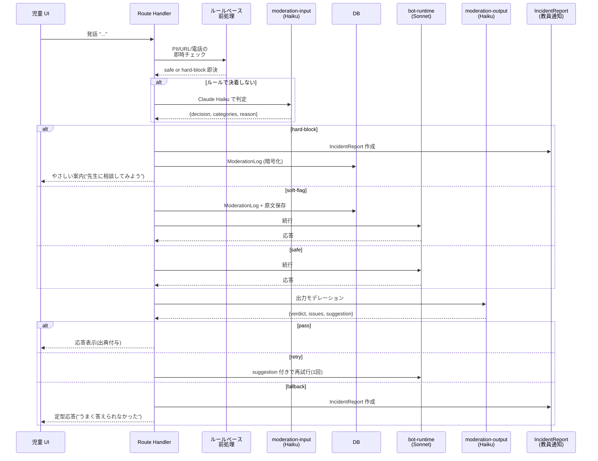
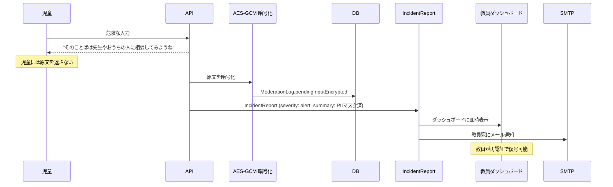
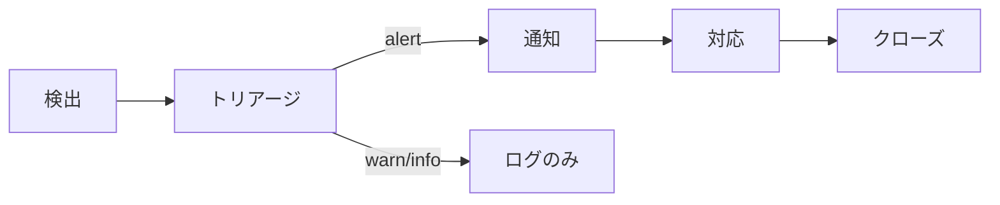

# 05. 安全性とプライバシー設計

> **このドキュメントに書かれた要件を満たさない実装はリリース不可**。
> 小学生向けプロダクトとして、安全性は一切妥協しない。

---

## 🧭 基本原則

1. **子どもの安全 > すべて**
2. **疑わしきは安全側に倒す**(False Positive を許容、False Negative は許容しない)
3. **監査は技術で、対応は人で**(検出は自動、エスカレーションは教員へ)
4. **データは最小主義**(取らなくていいものは取らない)
5. **説明可能**(なぜブロックされたか、教員は必ず分かる)

---

## 🔐 多層モデレーション設計

### 全体フロー



### 3 つのフェーズの責任範囲

| フェーズ | 実行タイミング | モデル | 何を見る |
|---------|---------------|--------|---------|
| **ルールベース前処理** | 入力受信直後 | (なし) | 電話・メール・明白な PII の即時検出 |
| **入力モデレーション** | ルール通過後・DB 保存前 | Haiku 4.5 | 6 カテゴリの判定 → `safe/soft-flag/hard-block` |
| **出力モデレーション** | Sonnet 応答生成後・表示前 | Haiku 4.5 | `ungrounded-claim, missing-citation, inappropriate-tone, unsafe-advice, pii-leaked, off-topic` |

詳細は [04-prompts/moderation-input.md](04-prompts/moderation-input.md) および [04-prompts/moderation-output.md](04-prompts/moderation-output.md)。

---

## 🛡️ ハードブロック時の挙動



**要点:**
- 児童には**原文を絶対に返さない**(繰り返しで試行される可能性)
- 暗号文は `ModerationLog.pendingInputEncrypted` に保存
- 鍵は教員ロールのみアクセス、復号は**再認証**(マジックリンク再送)が必要
- `IncidentReport` に PII マスク済みサマリを残し、教員ダッシュボード+メール通知

---

## 🔒 個人情報保護

### 取得しない情報
- 本名(フルネーム)
- 住所(番地レベル以下)
- 電話番号
- メールアドレス(児童本人のもの)
- 学校名・クラス番号の入力を児童に要求しない
- 生年月日(学年のみ)

### 取得するが最小化する情報
- ニックネーム(教員が命名 or 児童が自分で)
- 学校コード(システム識別用、児童は入力せず選択のみ)
- 児童 ID(学校内で一意、英数字ベース)

### 顔写真・画像
- アップロード時に**クライアント側の顔検出**(face-api.js など)で顔を自動ぼかし
- 既定 ON(`SAFETY_FACE_BLUR_DEFAULT=true`)
- オフにする場合は確認ダイアログ(「ほかの人にも見られる可能性があります」)
- ナレッジ画像は Storage に保存、アクセス制御は `StorageAdapter` の signed URL 経由

### 音声
- Web Speech API は**クライアント側で完結**(録音データを外部に送らない)
- 文字起こし結果のみをサーバーに送信
- 音声ファイル自体は保存しない(Phase 4 で議論余地あり)

### 保護者同意フロー(**ログインなし、教員経由**)
- **13歳未満の全児童** に適用
- 保護者用のログインや独立ポータルは**提供しない**
- 教員が紙の同意書・個別説明会・学校配布ツールで同意を取得し、アプリに手入力
- `ConsentRecord` に `kind` 単位で記録:
  - `llm-usage`(AI 対話の利用)
  - `image-gen`(画像生成)
  - `class-share`(クラス内の広場公開)
  - `home-use`(家庭での利用)
  - `voice-input`(音声入力)
  - `research-participation`(研究用データ収集・エピソード抽出・共起分析の対象化)
- `grantedBy='guardian'` とし、`grantedAt` と自由メモ(取得手段)を付記
- 全件同意が無いと児童ログインをブロック(緊急時は教員が教室単位で一括同意を代行可、ただし監査ログ残り)
- 撤回されたら `revokedAt` 記録 → 該当機能のデータ収集が停止。研究機能の場合は過去データも削除可

---

## 🏰 「つくってみようモード」のサンドボックス

最も攻撃面が大きい機能。**多層防御**で安全性を確保。

### 第 1 層: プロンプト制約
[04-prompts/mini-app-codegen.md](04-prompts/mini-app-codegen.md) で `fetch`, `eval`, 外部 URL, `import` 等を**生成させない**。

### 第 2 層: 静的スキャン
`lib/sandbox/static-scan.ts` で生成コードを正規表現スキャン:

```ts
const FORBIDDEN_PATTERNS = [
  { name: 'fetch', re: /\bfetch\s*\(/ },
  { name: 'XMLHttpRequest', re: /\bXMLHttpRequest\b/ },
  { name: 'WebSocket', re: /\bnew\s+WebSocket\b/ },
  { name: 'EventSource', re: /\bEventSource\b/ },
  { name: 'eval', re: /\beval\s*\(/ },
  { name: 'Function-constructor', re: /\bnew\s+Function\s*\(/ },
  { name: 'setTimeout-string', re: /setTimeout\s*\(\s*['"`]/ },
  { name: 'setInterval-string', re: /setInterval\s*\(\s*['"`]/ },
  { name: 'import', re: /\bimport\s*\(/ },
  { name: 'script-src', re: /<script[^>]*\ssrc\s*=/i },
  { name: 'link-external', re: /<link[^>]*\shref\s*=\s*['"]?https?:/i },
  { name: 'localStorage', re: /\blocalStorage\b/ },
  { name: 'sessionStorage', re: /\bsessionStorage\b/ },
  { name: 'clipboard', re: /\bnavigator\.clipboard\b/ },
  { name: 'window-open', re: /\bwindow\.open\b/ },
  { name: 'location-assign', re: /\blocation\.(assign|replace|href\s*=)/ },
];
```

1件でもマッチ → 生成コードを**実行せず**、児童には「もう一度ためしてみよう」と案内、`IncidentReport` 起票。

### 第 3 層: iframe sandbox 属性
```html
<iframe
  sandbox="allow-scripts"  <!-- allow-same-origin は付けない -->
  src="about:blank"
  srcdoc="<!DOCTYPE html>..."
></iframe>
```
- `allow-same-origin` が無いため、親オリジンの localStorage / cookie にアクセス不可
- `allow-scripts` のみで JS は動くが、同一オリジン扱いではなくなる

### 第 4 層: CSP(iframe 親が付与)
```
Content-Security-Policy:
  default-src 'none';
  script-src 'unsafe-inline';
  style-src 'unsafe-inline';
  img-src data:;
  font-src data:;
  media-src data:;
```
- 外部ネットワークへの一切の通信を遮断
- data URI 画像・音声のみ許可

### 第 5 層: 監査ログ
- 生成コード本体は `Artwork.appCodeHtml` に保存
- スキャン結果(`staticScanResult`)もセット保存
- 不審なスキャン結果は教員ダッシュボードで集計表示

### 想定する攻撃と対策
| 攻撃 | 対策 |
|------|------|
| プロンプトインジェクションで fetch を生成 | 静的スキャンで検出 + CSP で遮断 |
| データ URI 化した iframe で外部読み込み | CSP `default-src 'none'` で child-src もブロック |
| `eval` の難読化(String.fromCharCode) | 静的スキャンで evaluated string を検出、runtime は allow-scripts だが same-origin 無しで防御 |
| 親ウィンドウへの postMessage | 親側で `window.addEventListener('message')` を設けない |
| SVG 内の `<script>` | CSP 適用範囲内、allow-scripts 依存 |

---

## 🧠 教育的健全性

### AI は断定しない
- システムプロンプト([bot-runtime.md](04-prompts/bot-runtime.md))で「かもしれないよ」「本やせんせいにもきいてね」を必ず使う
- UI 常設文言: 「⚠️ AI はまちがえることがあるよ」(対話画面ヘッダ、小さく but always)
- ナレッジ外の質問: 「それはまだ調べていないよ、いっしょに調べてみよう!」を**構造的に返す**(プロンプト + 出力モデレーションの二重強制)

### 出典を機械的に付与
- LLM にも `<cite cards="..."/>` を出させるが、**それを信じない**
- アプリ層 (`lib/llm/cite.ts`) で `Source.title` を照合し、末尾に `\n📚 出典:◯◯、△△` を付与
- 児童に見える最終文は必ず出典ありで、**LLM 任せではない**

### 依存防止
- 連続セッション `SAFETY_CONTINUOUS_USE_WARN_MINUTES=20` 分超で休憩モーダル
  - 「ちょっと目をやすめよう。水のんでからもどってきてね」
- 1 日の LLM 呼び出し上限 `SAFETY_DAILY_LLM_CALL_LIMIT_PER_USER=100` 回
  - 超過時: 「きょうは たくさん しらべたね!つづきは あしたにしよう」
- 教員設定で上限を教室単位で調整可能

### 自傷・いじめの兆候
- 入力モデレーションで `self-harm` や `bullying` が `hard-block` → 即 `IncidentReport (severity: alert)` + 教員通知
- `soft-flag` でも連日続くようなら alert に昇格(Phase 4 で検討)
- 児童への応答は**共感一言のみ**、「おうちのひとや せんせいに はなそうね」で誘導
  - 具体的な相談窓口(チャイルドライン等)を教員ダッシュボードに案内

---

## 🔑 認証・セッション・アクセス制御

詳細は [07-auth.md](07-auth.md)。ここでは安全観点のみ。

- **児童パスワードはハッシュ化**(argon2id, メモリコスト 19MiB, 3 passes)
- セッションは HttpOnly + SameSite=Strict + Secure(本番)
- 連続失敗 `KIDS_AUTH_MAX_ATTEMPTS=5` で `KIDS_AUTH_LOCKOUT_MINUTES=10` ロック
- 教員ロールでの操作は**重要操作(モデレーション復号・児童データ削除)で再認証**

---

## 📜 日本の法令・ガイドライン

### 個人情報保護法(令和4年改正)
- 要配慮個人情報(病歴等)を収集しない
- 児童の「利用目的」を保護者向け同意画面で明示
- 児童には「プライバシーにかかわることは書かない」ルールを UI で繰り返し伝える

### 文部科学省「教育の情報化に関する手引」「生成 AI の利用に関する暫定的なガイドライン」
- AI が提示した情報を**うのみにしない**:UI 常設文言で実装
- 自分の考えを整理する**道具**として使う:「AI に教える」体験設計で実装
- 個人情報の入力防止:モデレーション・UI 案内で多層対応

### COPPA(参考、米国法)
- 13 歳未満の個人情報収集に保護者同意:ConsentRecord で実装
- 実名・住所・顔画像の収集最小化:取得しない or 自動ぼかし

---

## 📊 監査とログ

### `AuditLog` に記録するもの
- すべての LLM 呼び出し(model, tokensIn, tokensOut, latency, costEstJpy)
- 認証イベント(login, logout, lockout)
- 児童データの参照(教員による復号・閲覧)
- 保護者同意の取得・取消
- 作品の公開・非公開切替

### `ModerationLog` に記録するもの
- `decision` が `safe` でないすべての入力・出力判定
- 暗号化済みの原文(hard-block 時)
- カテゴリ・理由・モデル名

### `IncidentReport` に記録するもの
- `hard-block` 全件
- `suspected-self-harm`(確信度が高い self-harm soft-flag の連続発生)
- `pii-leak` / `abuse` / `sandbox-escape`
- `severity=alert` は即メール通知、`warn` は日次ダイジェスト、`info` は週次

### ログ保持期間
- `AuditLog`: `AUDIT_LOG_RETENTION_DAYS=365` 日(教育実践の振り返り用途)
- `ModerationLog`: 90 日(PII含む暗号文)、その後は匿名化して統計に
- `IncidentReport`: 3 年(教員・学校の記録として)

---

## 🔁 インシデント対応フロー



### severity 定義
- **alert**: 24h 以内に教員対応必須(自傷示唆、フルネーム漏洩、サンドボックス不審、連続ハードブロック)
- **warn**: 翌授業日までに気づけば OK(連続使用超過、単発の soft-flag の蓄積)
- **info**: 統計的に把握できれば OK(off-topic など)

### 教員対応の UX
- ダッシュボードに「対応中」「対応済み」「エスカレート」のトグル
- 対応ノートは `IncidentReport.resolvedBy` / `payload.meta.note` に記録
- 必要に応じて学校管理者へエスカレート(Phase 4)

---

## 🔬 研究機能の追加的倫理設計

本アプリは、実習Ⅱ・Ⅲの授業研究を内部機能として支援する(詳細は [12-research-methods.md](12-research-methods.md))。
研究関連のデータ収集・分析(立ち止まりの言葉・事前事後アンケート・エピソード抽出・共起分析・対話ログ活用)は、**通常機能の延長**ではなく**独立した同意軸**を持つ。

### `ConsentRecord(kind='research-participation')`
- 研究参加には**独立した同意**が必要(LLM 利用の同意とは別軸)
- 教員が保護者に**研究目的・保管期限・撤回方法・返却方法**を事前に説明
- 単元の `Unit.researchMode=true` はこの同意が揃うまで ON にできない
- 画面 13(単元設計)で「倫理承認を確認」チェック必須(`Unit.ethicsApproval` に申請 ID と承認日時を記録)

### 匿名化の強制
- `EpisodeRecord.childAnonymousId` = `hash(userId + unitId + app_salt)` で生成
- Claude への入力時に `lib/moderation/pii.ts` で再マスク、出力にも検査を再実行
- `EpisodeRecord.narrative` は教員編集時も**PII 復活禁止**(テストで検証)
- 匿名 ID は単元内で一貫、単元間では変わる(横串分析を防ぐため)

### データ保管と返却
- 研究用データ(`ReflectionEntry`, `StanceSnapshot`, `MissingVoiceHypothesis`, `Message` 単元紐付き分)の保管期限は **365 日既定**(`AUDIT_LOG_RETENTION_DAYS`)、研究計画で延長するなら記録を明示
- **単元終了後、児童本人には対話ログ全量を**テキスト/PDF で返却(研究倫理の要請)
- `ConsentRecord(kind='research-participation').revokedAt` 設定時は、該当児童の研究用派生データ(`EpisodeRecord`, 共起分析の入力)を**物理削除**
- 研究目的が終わった単元は `Unit.status='closed'` に移行、以後収集停止

### 設問の中立性
- 事前事後アンケートは [pre-post-survey-gen.md](04-prompts/pre-post-survey-gen.md) の中立性制約を通す
- 教員は画面 13 で neutralityCheckNotes を読み、**「編集してから承認」**を必ず踏む
- 指導教員との照合のため PDF 出力(Phase 4)

### 利益相反と開示
- 本アプリが実習研究を支援する設計を持つ事実は、オンボーディング画面と README で明示
- 学校は研究参加のクラスを選択でき、非参加クラスでも通常機能は利用可

---

## ✅ 安全性のチェックリスト(リリース前)

- [ ] すべてのユーザー入力経路で、ルールベース + Haiku モデレーションが動く
- [ ] すべてのボット応答に、出典がアプリ層で付与されている(テストで保証)
- [ ] hard-block 時に原文が児童に返されない(テスト)
- [ ] `ModerationLog.pendingInputEncrypted` は教員ロール以外で復号できない(テスト)
- [ ] つくってみようモードの iframe で fetch/eval/外部リソースが動かない(E2E テスト)
- [ ] 顔写真アップロードで既定ぼかしが適用される(E2E)
- [ ] 連続使用警告が `SAFETY_CONTINUOUS_USE_WARN_MINUTES` で表示される(E2E)
- [ ] 保護者未同意の児童はログインできない(E2E)
- [ ] API キーがクライアントバンドルに含まれない(CI で grep)
- [ ] レート制限がユーザー・IP・トークン 3 軸で動く(単体テスト)

---

## 🔗 関連ドキュメント

- [04-prompts/](04-prompts/) — モデレーションプロンプト詳細
- [07-auth.md](07-auth.md) — 認証設計
- [09-risks.md](09-risks.md) — リスク一覧と対策の包括
- [02-data-model.md](02-data-model.md) — `ModerationLog`, `IncidentReport`, `AuditLog`
