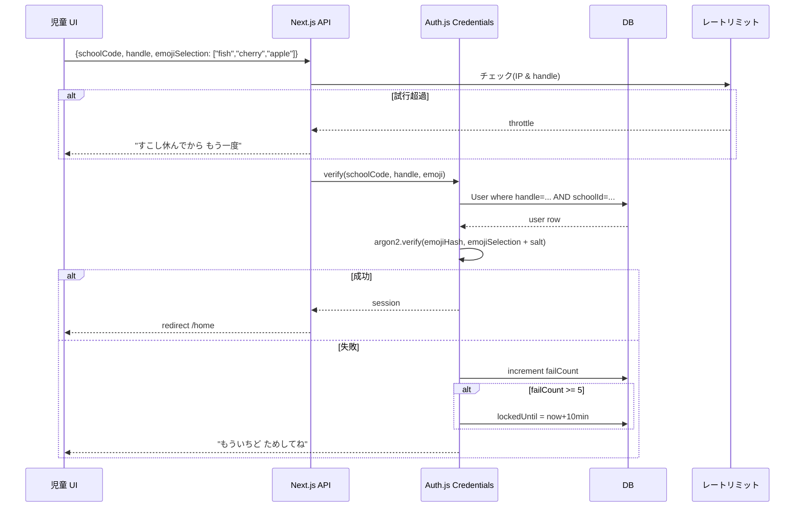

# 07. 認証設計(絵柄パスワード)

> 小学 1 年でも自分でログインできる、でもセキュリティは妥協しない。
> 児童は **学校コード + 児童 ID + 絵柄パスワード**、教員は **マジックリンク**。
> **保護者用のログインは持たない**(保護者同意は教員経由で記録)。

---

## 🎯 設計方針

1. **児童は本名・メール不要**。教室のタブレットで 10 秒でログインできる
2. **パスワードの「記憶」を絵柄で代替**。アルファベットを知らない低学年でも使える
3. **連続失敗でロック**。教員が再発行できる
4. **ロール分離**: 児童 / 教員 / 管理者(保護者は**ログインしない**)
5. **再認証**: 教員の重要操作(モデレーション復号・児童削除)では再認証
6. **保護者との接点は教員経由**: 同意は紙または教員個別説明で取得し、教員がアプリに記録

---

## 🧑‍🎓 児童認証(絵柄パスワード)

### 認証フロー



### データモデル
```prisma
model User {
  id                String   @id @default(cuid())
  role              String   // 'student'
  schoolId          String?
  handle            String?  @unique  // 学校内で一意(例: s-4-02-015)
  nickname          String?
  emojiPasswordHash String?  // argon2id ハッシュ
  emojiPasswordSalt String?
  avatarSeed        String?
  // ...
}
```

### 絵柄パスワードの構造
- **絵柄プール**(`KIDS_EMOJI_POOL_SIZE`、既定 12):ログイン画面に表示される選択肢
- **パスワード長**(`KIDS_EMOJI_PASSWORD_LENGTH`、既定 3):児童が順に選ぶ絵柄の数
- **エントロピ**: 12^3 = **1728 通り**
  - 連続失敗 5 回ロック → 期待試行 345 回(5/1728 × 平均)で引ける確率 0.3% 以下、運用上は十分
- 低学年向けに `KIDS_EMOJI_POOL_SIZE=8, KIDS_EMOJI_PASSWORD_LENGTH=2` の設定も可(64 通り、ただし監視強化)

### 絵柄の種類と表示順
- **絵柄**: 子どもに親しみやすい 30 種をプロジェクトで用意(動物・食べ物・自然・乗り物)
  - 例: 🐟 🌸 🍎 🚀 🐶 🌞 🎈 🦋 🌈 🌙 🍩 ⭐ 🍊 🐱 🌳 🚗 🎵 ⚽ 🦁 🍓
- 画像は `public/emoji/<name>.svg` にベクター SVG(色覚多様性配慮、輪郭も描く)
- **表示順は毎回シャッフル**(肩越し観察対策。順番で覚えられない)
- **並び順は同じ**(ログイン中のみ固定。ページリロードで再シャッフル)

### ハッシュ化
- **argon2id**(メモリ 19MiB、3 passes、並列 1)
- ソルトは 16 バイトランダム、ユーザーごとに固有
- 実装: `argon2` npm パッケージ(Node.js ネイティブ)
- ハッシュ対象: 選択された絵柄名を canonical 順で連結(例: `"apple|cherry|fish"`)し、`salt||PEPPER` と結合(PEPPER は環境変数で別管理 → DB 漏洩時でも即時解読不可)

### ロックアウトとレートリミット
- **ユーザー単位**: 連続失敗 `KIDS_AUTH_MAX_ATTEMPTS=5` で `KIDS_AUTH_LOCKOUT_MINUTES=10` ロック
  - `User.failedLoginCount` と `User.lockedUntil` を追加(schema 最終版で反映)
- **IP 単位**: 10 分間に 30 回失敗で IP 一時ブロック
- **全体**: 1 日の児童認証失敗総数が閾値超えで管理者通知

### 教員による再発行
- 教員ダッシュボードの児童詳細から「絵柄パスワードを変える」
- 新しい 3 絵柄を選び、保存。児童本人には紙のカードで渡すワークフロー
  - 紙のカードに絵柄が印刷される PDF を生成(Phase 4 で仕組み化、Phase 1 は画面表示)

### 学校コード
- `School.code` は短い英数字(例: `tokyo-1st-es`、9〜20 文字)
- ログイン画面では**プルダウン選択**(自由入力させない、タイポ防止)
- 端末にローカル保存(`localStorage` の `lastSchoolCode`)→ 次回から既定表示
- 教員設定で「端末保存を無効化」可(卒業学年の端末使い回し対策)

---

## 👩‍🏫 教員認証(マジックリンク)

### フロー
1. 教員が `/teacher/signin` にメールアドレスを入力
2. サーバーが署名付き 10 分有効トークンを生成、SMTP でリンク送付
3. 教員がリンククリック → トークン検証 → セッション作成

### Auth.js 構成
- `EmailProvider` with Nodemailer
- SMTP 設定は `.env.example` の `SMTP_*` 参照
- ローカル開発: **MailHog**(`smtp://localhost:1025`、UI は `http://localhost:8025`)

### 教員ロールの確認
- マジックリンクで認証後、`User.role='teacher'` かつ `School` に属していることを検証
- 管理者が事前に教員アカウントを登録する運用(児童のように自己登録不可)

### 重要操作での再認証
以下の操作では、セッションに関係なく**マジックリンクを再送**して再認証を要求:
- 児童の `ModerationLog.pendingInputEncrypted` の復号
- 児童データの削除(`User`, `Bot` カスケード)
- クラスごとの `School` 設定変更
- 保護者同意の遡及的取消
- インシデント報告の「エスカレート」ボタン

---

## 👨‍👩‍👧 保護者との接点(**ログインなし**)

**保護者用のログイン・独立したポータル画面は提供しない**。
保護者関連のワークフローはすべて教員経由で完結させる。

### 同意取得フロー
1. 教員が保護者に説明(紙の同意書 / 個別説明会 / 学校からの通知)
2. 教員が受領した同意情報をアプリに手入力
   - 対象児童、`ConsentRecord.kind`(`llm-usage`, `image-gen`, `class-share`, `home-use`, `voice-input`, `research-participation`)、`grantedBy='guardian'`、`grantedAt`、自由メモ
3. 同意が全て揃うまで、児童はアプリにログインできない(教員設定で緊急時に一括同意可)

### 同意の記録と管理
- `ConsentRecord` に記録、`GuardianLink` は**児童 ↔ 保護者氏名(文字列)の紐付けのみ**(メールアドレスなし)
- 教員が撤回を受けたら `revokedAt` を設定、連動して収集項目が停止
- 対話ログや作品の**返却は教員経由**(PDF 出力を教員が紙や学校配布ツールで保護者に渡す)

### 権限(保護者はアプリにアクセスしない)
- 保護者は閲覧ログインを持たない
- 児童の作品・振り返り・対話ログは、**教員が紙/PDF/学校配布ツールで**保護者に渡す
- 保護者からの問い合わせ・同意撤回はすべて教員を経由

### 削除される機能
- ~~保護者向けマジックリンク~~
- ~~保護者ポータル(`/guardian/*`)~~
- ~~保護者週次レポート閲覧画面~~
- ~~保護者同意画面(Web)~~

---

## 🔑 セッション管理

### Cookie
| 属性 | 値 |
|------|----|
| HttpOnly | ✅ |
| SameSite | `Strict` |
| Secure | ✅(本番) |
| Max-Age | 児童 4h、教員 12h |
| Path | `/` |

### セッション更新
- アクティビティで **slidingExpiration**(最終リクエストから N 時間)
- `User.lastActiveAt` を更新

### ログアウト
- 児童: 明示的なログアウトボタン(教室の端末共有を想定)
- 教員: 12h で自動ログアウト

---

## 🧩 Auth.js (NextAuth v5) 統合例

```ts
// lib/auth/config.ts(参考実装の概略)
import Credentials from 'next-auth/providers/credentials';
import Email from 'next-auth/providers/nodemailer';
import { verifyKidEmojiPassword } from './kids-credentials';
import { prisma } from '@/lib/prisma';

export const authConfig = {
  providers: [
    // 児童: 絵柄パスワード
    Credentials({
      id: 'kids',
      name: '児童ログイン',
      credentials: {
        schoolCode: { type: 'text' },
        handle: { type: 'text' },
        emojiSelection: { type: 'text' }, // JSON 配列
      },
      async authorize(creds) {
        if (!creds) return null;
        const user = await verifyKidEmojiPassword(creds);
        return user ?? null;
      },
    }),

    // 教員のみ: マジックリンク(保護者ログインは提供しない)
    Email({
      server: {
        host: process.env.SMTP_HOST,
        port: Number(process.env.SMTP_PORT),
        auth: process.env.SMTP_USER
          ? { user: process.env.SMTP_USER, pass: process.env.SMTP_PASS }
          : undefined,
      },
      from: process.env.SMTP_FROM,
    }),
  ],
  callbacks: {
    async session({ session, user }) {
      session.user.role = user.role;
      session.user.schoolId = user.schoolId;
      return session;
    },
  },
  pages: {
    signIn: '/signin',
    verifyRequest: '/verify-request',
  },
  session: { strategy: 'database' },
};
```

---

## 🛡️ アクセス制御

### ロール別ルートガード
Next.js App Router のレイアウトで実装:

- `/` (kids group) → `role === 'student'`
- `/teacher/*` → `role === 'teacher'`
- `/admin/*` → `role === 'admin'`

児童が教員ルートに直接アクセス → `403` +「このページは せんせい用だよ」
保護者用のルート(`/guardian/*` 等)は**提供しない**。

### データアクセス
- 児童は自分の `Bot` と、同クラスの公開ボットのみ取得可
- 教員は所属 `School` の `Class` に所属するデータのみ
- `GuardianLink` は情報ラベル(保護者氏名の記録)のみで、読み取り主体は教員(保護者セッションは存在しない)
- Prisma クエリ層で `where` 条件を必ず付与(RLS 的な設計、テストで検証)

---

## 🔐 秘密情報の扱い

| 種類 | 保管 |
|------|------|
| `AUTH_SECRET` | `.env.local`、本番は環境変数 |
| `ANTHROPIC_API_KEY` 等 | 同上 |
| 絵柄パスワード PEPPER | `.env.local` の独立変数(DB と分離) |
| 暗号化鍵(`ModerationLog.pendingInputEncrypted`) | AWS KMS / HashiCorp Vault(本番)/ 環境変数(開発) |

### 禁則
- **任意の秘密を Git にコミットしない**(`.gitignore` に `.env*` 追加済み前提、CI で検査)
- **クライアントバンドルに秘密が漏れていないか CI で grep**
- **ログに秘密が混入しないか**(Sentry 送信前のフィルタ必須)

---

## 🧪 テスト観点

- 正しい学校コード・ID・絵柄でログインできる
- 1 文字違いの絵柄でログインできない
- 連続 5 回失敗でロック、10 分後に解除
- 教員の再発行で新しい絵柄でログインできる
- 児童が `/teacher/*` にアクセスすると 403
- マジックリンクの有効期限切れで再発行を促す
- 重要操作で再認証を要求される

---

## 🔗 関連ドキュメント

- [02-data-model.md](02-data-model.md) — User / Session / VerificationToken
- [05-safety-and-privacy.md](05-safety-and-privacy.md) — 暗号化とアクセス制御
- [03-screens.md](03-screens.md) — ログイン画面
