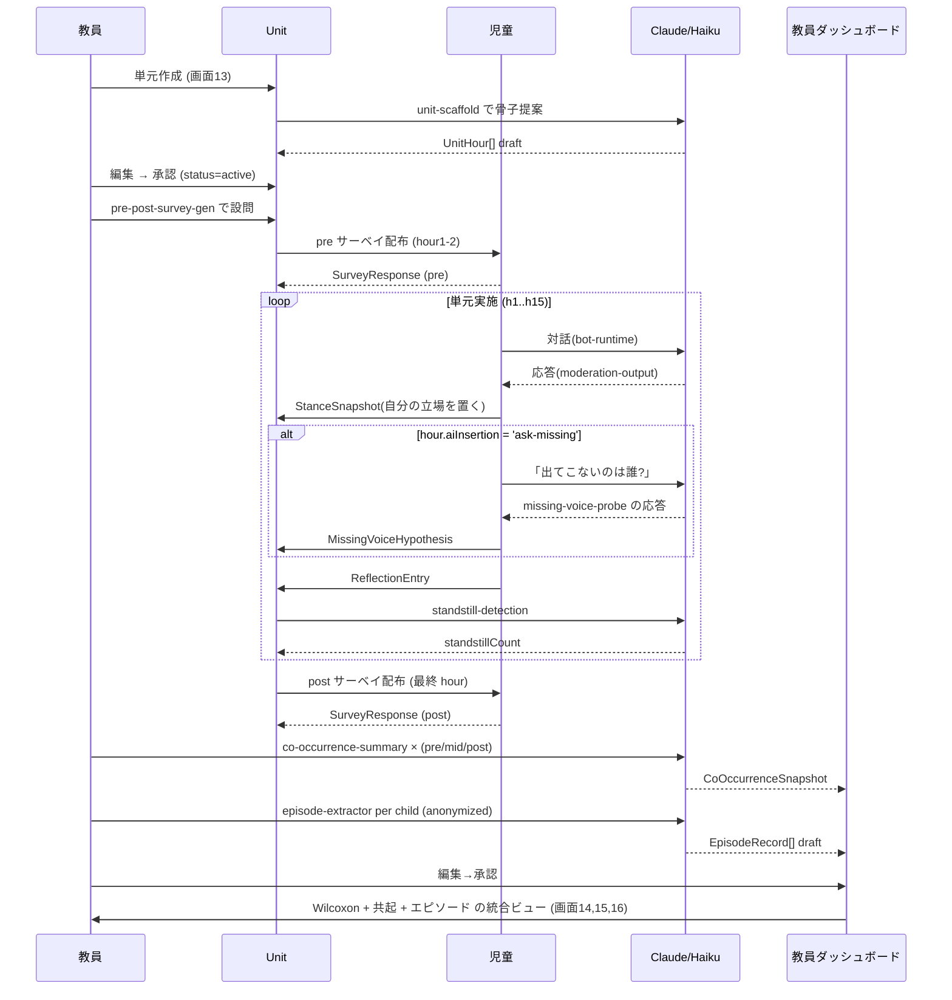

# 12. 研究方法論の実装(実習Ⅱ・Ⅲの原理をアプリに落とす)

> 実習Ⅱ(事前意識調査)と実習Ⅲ(単元実践と評価)で必要な
> 測定・分析・倫理の要件を、アプリの機能・データフロー・UX に具体化する。
> 評価票の5領域(①〜⑤)と、本ドキュメントの各節の関連を丸数字で示す。

---

## 🧭 この実装が背景とする空白

学習指導要領解説 社会編と文部科学省の生成AI暫定ガイドラインは、
多面的・多角的な考察と批判的活用を求めつつ、具体的な授業原理にまでは
踏み込んでいない(①②)。池野範男らの論争問題学習・公共的判断研究は、
多様な立場の提示が判断の質を高めることを示してきたが、**生成AIが多数派の声を
返しやすい性質そのものを教材化**し、「AIに出てこないのは誰か」を問いの核に
据えた実践は報告されていない(②)。

本アプリは、この空白に対し、次の原則で応答する:

- AIを**調べ学習の補助**としてではなく、**子どもの思考を問い直す触媒**として位置づける(②)
- AIの限界を学びの触媒に転じる授業原理を、**検証可能な形で**差し出す(①②⑤)
- 授業実践の質的エピソードと量的指標を**同一データから**取り出せる設計にする(②)

---

## 🔬 実習Ⅱ:事前の意識調査をアプリに組み込む

### 測定する 3 軸(①②③)

| 軸 | 何を測るか | 設問形式 | データモデル |
|----|-----------|---------|------------|
| axis-initial-position | ある問いに対して最初に挙がる立場の内訳 | single-choice + short-text | `SurveyResponse` |
| axis-majority-pull    | 目立つ立場への集中度                   | likert-5 × 3 問         | `SurveyResponse` |
| axis-other-awareness  | 自分と違う考えへの意識の強さ           | likert-5 + short-text    | `SurveyResponse` |

### 量的集計
Google Forms を使わずアプリ内で完結:
- `SurveyInstrument(kind='pre')` を `Unit` ごとに配布(画面 13 で教員が作成・編集)
- 児童は画面 14(自分のタブレット)で回答 → `SurveyResponse` に保存
- 教員ダッシュボード画面 14 で分布・平均・中央値を即時表示

### 質的分析
自由記述は形態素解析 + 共起分析:
- `lib/research/morphology.ts` で kuromoji.js トークナイズ
- `lib/research/cooccurrence.ts` で共起ペア算出(KH Coder の共起ネットワーク代替)
- 教員ダッシュボード画面 16 で、Claude による意味づけを添えて可視化([co-occurrence-summary.md](04-prompts/co-occurrence-summary.md))

### 倫理設計(④⑤)
- 調査そのものが子どもの判断を方向づける批判を受け止めるため、
  設問は [pre-post-survey-gen.md](04-prompts/pre-post-survey-gen.md) の**中立性制約**を通す
- 誘導語(「正しい立場」「当然」「べき」等)を禁則
- 最終判断は指導教員と照合。教員がアプリ上で全設問を編集できる
- `ConsentRecord(kind='research-participation')` 必須、保護者同意を教員経由で取得

### 得られた知見の扱い
得られた知見は、単元実施時の:
- 題材選定の参考
- AI 挿入ポイント(3 タイミング)の配置調整
- 個別支援を要する層の見当(多数派に寄る/対立を避ける/少数意見を取り下げる)
を判断する根拠になる(②③)。

---

## 🔬 実習Ⅲ:単元実施と過程の追跡

### 単元の骨子(①②)
- 地域社会と接点のある題材
- 10〜15 時間の中単元(`Unit.plannedHours`)
- 前半:事実と概念を厚くする
- 後半:価値の対立を扱う
- `Unit.researchMode=true` で研究データの詳細収集を許可

### AI 挿入の 3 タイミング
[unit-scaffold.md](04-prompts/unit-scaffold.md) が教員の下書きとして提案:

| 名前 | 配置 | 目的 |
|------|------|------|
| `before-self` | 前半 | 自分で考える前に AI で情報を広げる |
| `after-self` | 中盤 | 自分の考えをまとめた後に AI と突き合わせる |
| `ask-missing` | 中盤〜後半 | **「AIに出てこないのは誰?」を問う(研究の核)** |

### 量的指標(②)

#### 1. 立場の数
- `StanceSnapshot.phase='pre'` と `phase='post'` の間で、1 児童が識別した立場の種類の数
- 集計: `SELECT user_id, phase, COUNT(DISTINCT stance_id) FROM stance_snapshot GROUP BY user_id, phase`

#### 2. 「立ち止まりの言葉」の出現頻度
- [standstill-detection.md](04-prompts/standstill-detection.md) で自動検出
- ルールベース + LLM のハイブリッドで `ReflectionEntry.standstillCount` に集計
- 事前(最初の振り返り)と事後(最終の振り返り)の数を比較
- 対象語の例:
  - hesitation: でも、けれど、しかし
  - questioning: なぜ、どうして、ほんとに
  - reframing: 別の見方をすれば、違う見方、もしかしたら
  - self-correction: やっぱり、でも今は
  - empathizing: 〜の気持ちになると、〜の立場だったら
  - uncertainty: わからない、迷う、決められない

#### 3. 事前事後比較(Wilcoxon 符号順位検定)
- 分布を確認したうえで、ノンパラメトリックな Wilcoxon 符号順位検定を適用
- 1 児童 1 組(pre, post)のペアデータ
- `lib/research/stats.ts` の実装:

```ts
// lib/research/stats.ts
export type WilcoxonInput = Array<{ userId: string; pre: number; post: number }>;
export type WilcoxonResult = {
  n: number;             // 有効ペア数(差が 0 のペアは除外)
  Wplus: number;         // 正の符号順位和
  Wminus: number;        // 負の符号順位和
  statistic: number;     // min(Wplus, Wminus)
  zApprox: number;       // 正規近似
  pTwoSided: number;     // 両側 p 値
};

export function wilcoxonSignedRank(data: WilcoxonInput): WilcoxonResult {
  // 1) 差分 d_i = post - pre、d_i = 0 は除外
  // 2) |d_i| に順位付け(同順位は平均順位)
  // 3) d_i の符号別に順位和 Wplus, Wminus
  // 4) 正規近似 z = (statistic - n*(n+1)/4) / sqrt(n*(n+1)*(2n+1)/24)
  // 5) p = 2 * (1 - Φ(|z|))  ※ ある程度の n があれば実用的
  // ...
}
```

教員ダッシュボード画面 14 で、p 値とその**解釈の注意点**(cautions)を併記。

### 質的指標(②③)

#### 1. 振り返り記述と対話ログの KH Coder 風共起分析
- [co-occurrence-summary.md](04-prompts/co-occurrence-summary.md) を phase(pre/mid/post)× corpus(reflection/chat)で実行
- `CoOccurrenceSnapshot` に保存、画面 16 で教員が閲覧
- 「立ち止まり語」× 共起パートナーの変化は中核指標

#### 2. エピソード記述
- [episode-extractor.md](04-prompts/episode-extractor.md) で AI が候補生成
- `EpisodeRecord(status='draft')` → 教員が画面 15 で編集・承認
- 「判断が揺れた瞬間」「多数派に寄った後の立ち止まり」「少数意見の取り下げ」「AI 批判」などのタグ付き
- エピソードを先に示し、量的データで裏づける順序で報告(②)

#### 3. 平均値に現れない児童
- AI 活用に消極的だった層の個別軌跡を `stanceHistory + reflections + missingVoiceHypotheses` で追跡
- 個別の変容を読み取る、公共的判断の深化の質を質的に描き出す

---

## 🔁 データフロー:単元開始から研究アウトプットまで



---

## 🛡️ 研究倫理の実装(④⑤)

### 保護者同意
- `ConsentRecord(kind='research-participation')` を教員経由で取得
- `kind='llm-usage'`, `'class-share'` 等とは独立で管理
- 単元開始前に未同意の児童は、単元そのものは参加できるが、
  `Unit.researchMode=true` の収集対象からは除外される(個人データは統計に含まれない)

### 匿名化
- `EpisodeRecord.childAnonymousId` = `hash(userId + unitId + app_salt)`
  - 単元内では一貫、単元間では変わる
- 対話ログを Claude に渡す前に `lib/moderation/pii.ts` でマスク
- AI 出力にも PII 検査を再度かけ、漏れたら強制マスク+再生成

### データ保管期限
- `Unit.researchMode=true` 配下の `ReflectionEntry`, `StanceSnapshot`,
  `MissingVoiceHypothesis`, 対話ログは `AUDIT_LOG_RETENTION_DAYS=365` 既定(延長可)
- 単元終了後、児童本人には**対話ログ全量**を PDF/テキストで**返却**(研究倫理の要請)
- 研究利用が終わったら同意撤回で削除可能(`ConsentRecord.revokedAt` 設定で連動)

### 倫理申請との接続
- `Unit.ethicsApproval` に承認書 ID・承認日を記録(自由記述テキスト)
- 画面 13 で単元公開前に `Unit.researchMode=true` のときは「倫理承認を確認」チェック必須

### 調査の中立性
- [pre-post-survey-gen.md](04-prompts/pre-post-survey-gen.md) の neutralityCheckNotes を教員が読み、
  画面 13 で確認チェックをしてから公開
- 指導教員との照合を支援する「印刷 → 紙で確認」ボタン(Phase 4 で PDF 出力)

---

## ⚠️ 限界と留意点(①⑤)

アプリは測定を支援するが、**研究設計の責任は教員・研究者に残る**:

1. **単校実施の一般化の限界**: アプリはクラス単位の設計が既定。多校比較は `Unit` を跨いだ集計で可能だが、サンプリングの問題は残る
2. **立ち止まりの言葉の操作的定義の限界**: カテゴリ分けは暫定、語の多義性や文脈で解釈が分かれる
3. **AI が生成するエピソード記述の解釈余地**: 教員の編集が必須、そのまま発表用に使わない
4. **設問の言語依存**: 現状は日本語の立ち止まり語のみ、他言語版は未対応
5. **ウィルコクソン符号順位検定の前提**: ペアデータ、対称性の仮定などを画面 14 で注記
6. **AI 出力そのものがバイアスを含む**: 授業の題材として扱いつつ、分析ツールとしての Claude 出力も同じ吟味の対象にする

これらの限界は、画面 14/15/16 の **cautions** セクションで常時併記される。

---

## 📤 研究アウトプットの形

Phase 4 で教員が書き出せる PDF:
1. 単元サマリ(骨子、時数配分、AI 挿入ポイント、教科横断)
2. 事前事後アンケート結果(3 軸の分布、Wilcoxon 結果と cautions)
3. 共起ネットワーク(pre / mid / post)と立ち止まり語の共起パートナー変化
4. エピソード記述(教員承認済み、全て匿名化)
5. 児童個別軌跡(希望児童分、保護者承諾済み)
6. 授業者の振り返り(自由記述)

本アプリは**研究アウトプットの下書きを作る補助**。最終的な論文・実践記録の責任は研究者に残る(①⑤)。

---

## 🔗 関連ドキュメント

- [04-prompts/missing-voice-probe.md](04-prompts/missing-voice-probe.md) — 「AIに出てこないのは誰?」
- [04-prompts/standstill-detection.md](04-prompts/standstill-detection.md) — 立ち止まりの言葉
- [04-prompts/episode-extractor.md](04-prompts/episode-extractor.md) — エピソード抽出
- [04-prompts/co-occurrence-summary.md](04-prompts/co-occurrence-summary.md) — 共起分析
- [04-prompts/pre-post-survey-gen.md](04-prompts/pre-post-survey-gen.md) — 事前事後アンケート生成
- [04-prompts/unit-scaffold.md](04-prompts/unit-scaffold.md) — 単元骨子提案
- [02-data-model.md](02-data-model.md) — `Unit`, `StanceSnapshot`, `ReflectionEntry`, `SurveyInstrument`, `EpisodeRecord`, `CoOccurrenceSnapshot`, `MissingVoiceHypothesis`
- [05-safety-and-privacy.md](05-safety-and-privacy.md) — 匿名化と保護者同意
- [11-cross-curricular.md](11-cross-curricular.md) — 教科等横断
